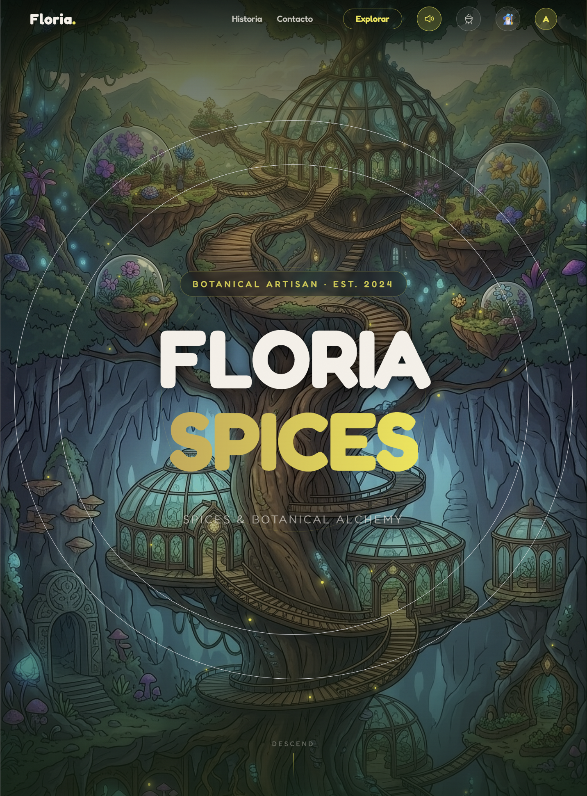
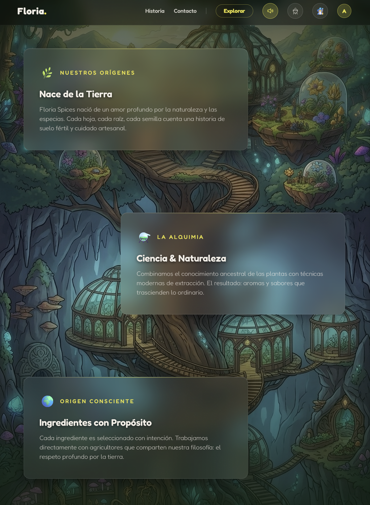
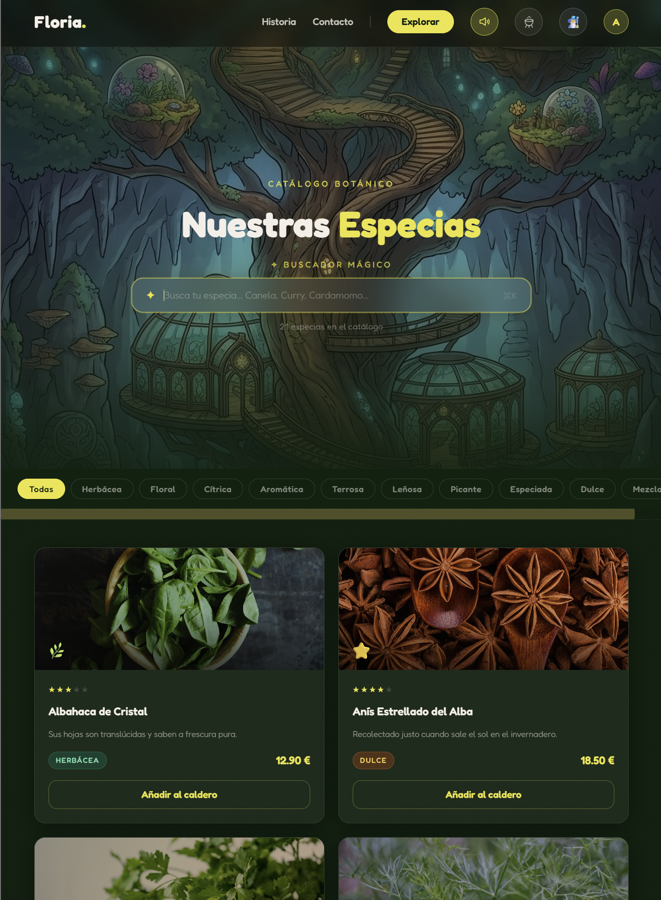
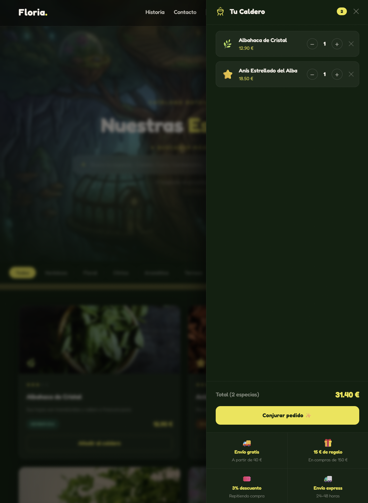
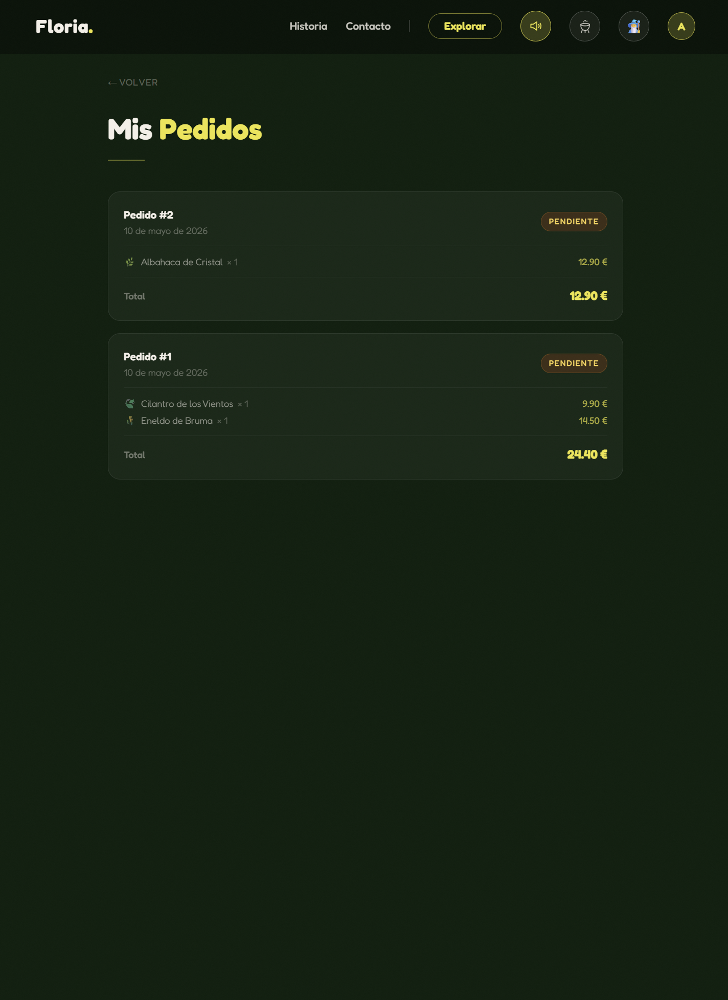
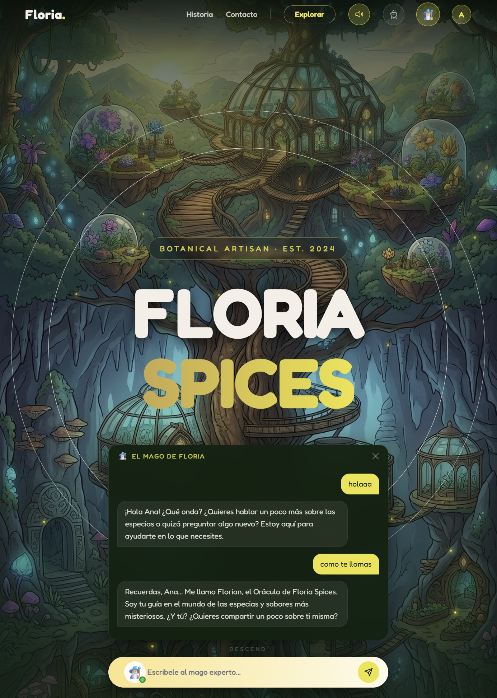
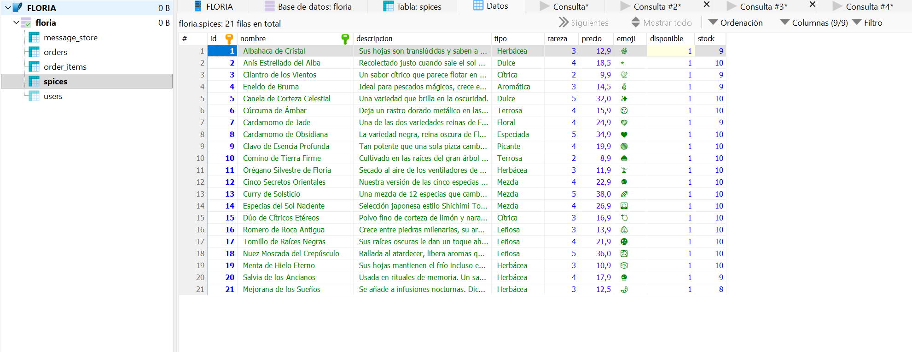
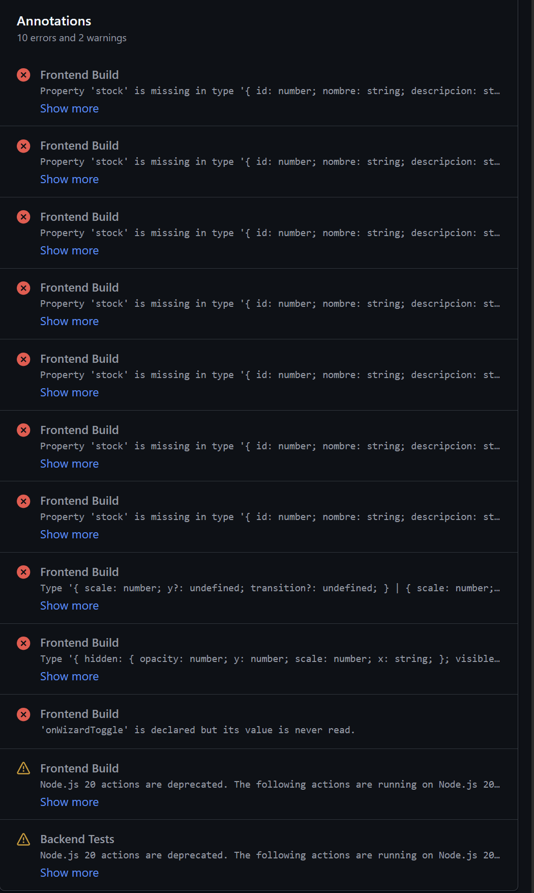
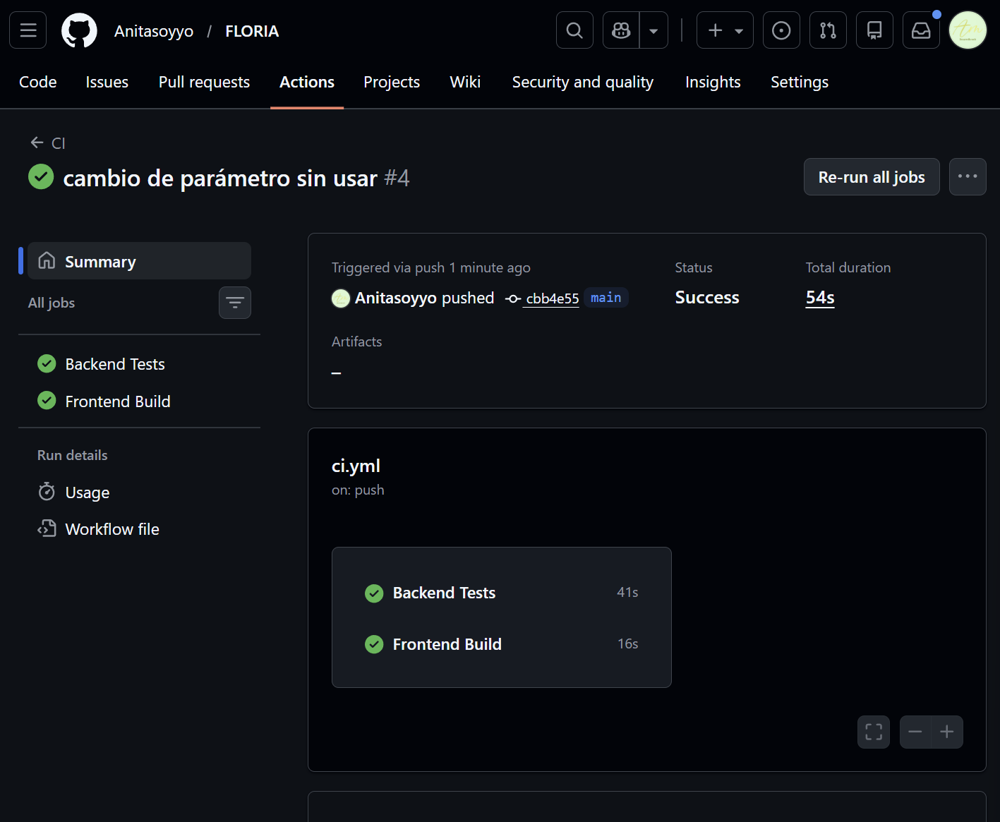

# Floria Spices 🌿

Una tienda online de especias botánicas con un punto de fantasía. El proyecto combina una experiencia de usuario inmersiva con un backend robusto, permitiendo a los usuarios descubrir el "alma" de cada ingrediente.

---
## Características Principales

Experiencia Visual Inmersiva: Diseño basado en Glassmorphism (efecto cristal) con Tailwind CSS

Wizard Chat Interactivo: Un asistente inteligente (El Mago de las Especias) que guía al usuario en la selección de las mezclas.

Diseño Responsive: Adaptado a cualquier tamaño de pantalla, desde móvil hasta escritorio.

Arquitectura PWA (Progressive Web App): La tienda es totalmente instalable en dispositivos móviles.


--- 

## ¿Qué es esto?

Una landing page + tienda funcional para una marca ficticia de especias artesanales. Tiene catálogo de productos con nivel de rareza y stock, carrito de compras, sistema de pedidos, autenticación con JWT y un pequeño asistente de IA integrado. La idea era construir algo que se viera bien pero que también tuviera lógica detrás.

---

## Capturas

<table cellpadding="20">
  <tr>
    <td></td>
    <td></td>
  </tr>
  <tr>
    <td></td>
    <td></td>
  </tr>
  <tr>
    <td></td>
    <td></td>
  </tr>
  <tr>
    <td colspan="2" align="center"></td>
  </tr>
</table>

---

## Stack

**Frontend:** React 18 + TypeScript + Vite + Tailwind CSS  
**Backend:** Python 3.13 + FastAPI + SQLAlchemy + SQLite  
**IA:** LangChain + Ollama (`llama3.2`) + ChromaDB + `nomic-embed-text`  
**Animaciones:** Framer Motion  
**Routing:** React Router v6

---

## Estructura del proyecto

```
floria/
├── frontend/          # React + Vite
│   └── src/
│       ├── components/
│       │   ├── layout/    # Navbar, Footer, UserMenu
│       │   ├── sections/  # HeroSection, StorySection
│       │   └── ui/        # CauldronDrawer, GlassCard, ScrollReveal...
│       ├── context/       # CartContext, AuthContext
│       ├── pages/         # HomePage, ExplorarPage, MisPedidos, MisDatos
│       └── hooks/
└── backend/
    └── app/
        ├── api/v1/routes/ # story, spices, auth, orders, chat
        ├── models/        # User, Spice, Order, OrderItem
        ├── schemas/       # Pydantic validators
        ├── ai/            # LangChain, ChromaDB, fact-checking
        │   └── docs/      # fichas Markdown de las 21 especias
        └── db/
```

La separación frontend/backend fue pensada desde el principio. Quería que el backend fuera una API que cualquier otro cliente pudiera consumir en el futuro, y que el frontend no tuviera nada de lógica de negocio hardcodeada. El frontend solo sabe hacer fetch a `/api/v1/...` y renderizar lo que recibe.

---

## Base de datos

Uso SQLite porque esto es un proyecto de portfolio, no una aplicación en producción. Para desarrollo local es cómodo y no requiere configurar nada extra. Si en algún momento quisiera pasar a PostgreSQL, SQLAlchemy hace que se pueda realizar el cambio facilmente.

Las tablas se crean automáticamente al arrancar con `Base.metadata.create_all()`. Para columnas que se añadieron después del primer deploy hice una migración manual con `ALTER TABLE`:

```python
def _run_migrations() -> None:
    with engine.connect() as conn:
        try:
            conn.execute(text("ALTER TABLE spices ADD COLUMN stock INTEGER DEFAULT 10"))
            conn.commit()
        except Exception:
            pass  
```

No es lo más elegante del mundo pero para SQLite funciona bien y es suficiente para este tipo de proyecto. Si escalara a un entorno real usaría Alembic con versiones de migración, pero aquí añade complejidad que no vale la pena.

---

## Autenticación

JWT con `python-jose`. Al registrarse o hacer login, el backend devuelve un token que el frontend guarda en `localStorage` (bajo la clave `floria_token`) y adjunta en los headers de las peticiones protegidas. Al recargar la página, el token se recupera automáticamente y se valida contra `/api/v1/auth/me` para restaurar la sesión.

Los pedidos solo se pueden hacer si estás autenticado. Si el token caduca, las rutas protegidas devuelven 401 y el frontend redirige al login.

Las contraseñas van hasheadas con `bcrypt` antes de guardarse en la base de datos.

---

## Gestión del carrito y pedidos

El carrito vive en un Context de React (`CartContext`). Cuando el usuario pulsa "Conjurar pedido", el frontend hace un POST a `/api/v1/orders` con los items del carrito. El backend:

1. Verifica que hay stock suficiente para cada especia
2. Crea el pedido con los precios en el momento de la compra (precio snapshot)
3. Descuenta el stock
4. Todo en una sola transacción para evitar inconsistencias

Si una especia se queda sin stock mientras alguien tiene el carrito abierto, el pedido se rechaza con un error descriptivo.

---

## Asistente de IA (El Oráculo)

El chat de la app usa **LangChain** con **Ollama** para correr un LLM en local (por defecto `llama3.2`). He preferido usar Ollama ya que es gratuíta y no hay que gestionar Apis Keys. Se puede cambiar facilmente de modelo a uno más potente si se quiere ya que este es un modelo más pequeño y con sus limitaciones pero para un proyecto "ficticio" es suficiente.

Lo que más me gustó de implementar esto fue la memoria de conversación. Uso `SQLChatMessageHistory` de `langchain-community` para guardar el historial de cada sesión directamente en SQLite, con un `session_id` por usuario. Así el asistente recuerda lo hablado anteriormente.

Como `llama3.2` es un modelo pequeño con tendencia a alucinar, implementé un sistema de **fact-checking propio** para evitarlo. Antes de cada respuesta, el sistema detecta si el usuario está preguntando por un producto concreto (busca palabras clave como "tenéis", "hay", "existe", "precio"...), extrae los sustantivos relevantes filtrando stop words, y los busca directamente en la base de datos. El resultado se inyecta en el mensaje antes de mandárselo al modelo:

```
[VERIFICACIÓN DE INVENTARIO:
   'menta' → encontrado en catálogo: Menta de Hielo Eterno (disponible)
   'lavanda' → NO existe en nuestro catálogo
]
```

Así el modelo no puede inventarse especias que no existen.

### Base de conocimiento con ChromaDB (RAG)

Para que el Oráculo pudiera responder preguntas detalladas sobre cada especia — origen, propiedades, usos culinarios, maridajes — conecté el chat a una **base de datos vectorial con ChromaDB**.

Creé 21 archivos Markdown (uno por especia) en `backend/app/ai/docs/`, cada uno con información propia del universo Floria: historia, propiedades, usos, maridajes con otras especias del catálogo y lore del invernadero. ChromaDB vectoriza esos documentos usando el modelo de embeddings `nomic-embed-text` (también via Ollama) y los almacena en `/app/data/chroma_db`.

En cada mensaje del chat, el sistema busca por similitud semántica los fragmentos más relevantes para esa pregunta y los inyecta en el prompt junto al inventario. Así el Oráculo pasa de saber **qué existe** a saber **todo sobre cada especia**.

El vector store se construye automáticamente la primera vez que se hace una petición al chat. Las siguientes lo cargan directamente desde disco.

**Nota sobre el modelo:** Se usa `llama3.2` por ser gratuito, local y no requerir API key. Al ser un modelo pequeño (2GB), tiene limitaciones a la hora de seguir estrictamente el contexto RAG, tiende a mezclar la información de los archivos Markdown con su propio conocimiento de entrenamiento. Con un modelo más grande (`llama3.1:8b`, `mistral`) los resultados serían más precisos, pero requieren más RAM. El objetivo de esta integración era aprender a conectar una base de datos vectorial con LangChain y entender el flujo RAG completo, no optimizar la calidad de respuesta del modelo.

---

## Animaciones

El componente de chat y el sistema de interacción del drawer fueron evolucionados a partir de patrones de diseño encontrados en la página: 21st.dev. Aunque partí de una base existente, realicé la adaptación para ajustar la lógica a la web de Floria personalizando las transiciones de Framer Motion y conseguir una fluidez que encajara con la estética.

---

## Diseño y colores

Todo el color está en tokens de Tailwind, nunca valores hexadecimales sueltos en el código. Esto lo aprendí de proyectos anteriores donde cambiar un color implicaba un buscar-y-reemplazar por todo el proyecto.

```js
// tailwind.config.ts
colors: {
  'floria-deep':  '#0a1f0d',
  'floria-cream': '#f5ede0',
  'floria-gold':  '#c9963c',
}
```

El fondo del hero es una imagen generada con **[nanobanana.com](https://nanobanana.com)** : herramienta para crear imágenes con IA. También usé nanobanana para la imagen de la página de explorar.

---


## Cómo arrancar el proyecto

### Con Docker (recomendado)

El proyecto está contenerizado con Docker Compose. Levanta frontend, backend y Ollama con un solo comando:

```bash
docker compose up --build
```

| Servicio | URL |
|---|---|
| Frontend | http://localhost:5173 |
| Backend / API | http://localhost:8000 |
| Docs API | http://localhost:8000/api/docs |

La primera vez hay que descargar los modelos de IA (solo una vez, los datos quedan en un volumen):

```bash
docker compose exec ollama ollama pull llama3.2
docker compose exec ollama ollama pull nomic-embed-text
```

`llama3.2` es el modelo de chat del Oráculo. `nomic-embed-text` es el modelo de embeddings que usa ChromaDB para vectorizar las fichas de las especias.

### Sin Docker

#### Backend

```bash
cd backend
python -m venv .venv
.venv\Scripts\activate      # Windows
# source .venv/bin/activate  # Mac/Linux
pip install -r requirements.txt
cp .env.example .env
uvicorn app.main:app --reload
```

La API estará en `http://localhost:8000` y la documentación en `http://localhost:8000/api/docs`.

#### Frontend

```bash
cd frontend
npm install
npm run dev
```

La app estará en `http://localhost:5173`.

---

## Tests

El backend tiene tests de integración con **pytest** que corren contra una base de datos SQLite en memoria, sin tocar la base de datos real ni necesitar Ollama.

```bash
cd backend
pip install -r requirements.txt -r requirements-dev.txt
pytest tests/ -v
```

Cubren tres áreas:

| Archivo | Qué testa |
|---|---|
| `test_health.py` | El servidor levanta y responde |
| `test_spices.py` | Catálogo: listado, campos, búsqueda por nombre |
| `test_auth.py` | Registro, login, email duplicado, rutas protegidas |

## CI con GitHub Actions

Cada push y pull request a `main` ejecuta automáticamente dos trabajos en paralelo:

- **Backend Tests** — instala dependencias y corre pytest
- **Frontend Build** — instala dependencias y verifica que el frontend compila sin errores

La configuración está en `.github/workflows/ci.yml`.

El CI detectó errores de TypeScript en el primer push — tipos incompletos en el interface `Spice`, una prop sin usar y variantes de Framer Motion mal tipadas — que fueron corregidos antes de mergear:



Tras corregir los errores, ambos jobs pasan en verde:



---

## Notas

- El asistente de IA necesita dos modelos de Ollama: `llama3.2` (chat) y `nomic-embed-text` (embeddings para ChromaDB). Ver comandos de arranque arriba.
- Los datos se inicializan solos al arrancar el backend por primera vez.
- La base de datos SQLite y el vector store de ChromaDB persisten entre reinicios del contenedor gracias a volúmenes Docker.
- El vector store de ChromaDB se construye automáticamente la primera vez que se usa el chat.
- Para visualizar la base de datos (`floria.db`) con sus tablas y columnas directamente en VS Code, instala la extensión **SQLite Viewer** de Florian Klampfer.
